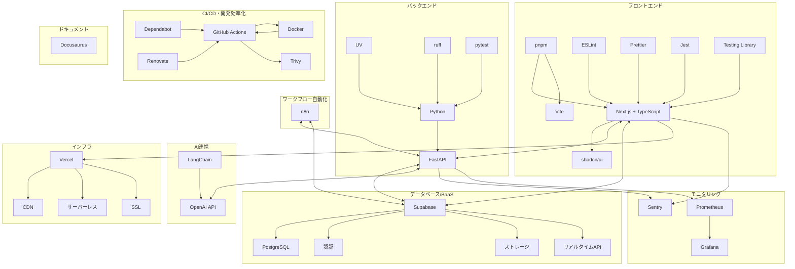

```mermaid
flowchart TB
    subgraph "フロントエンド"
        next[Next.js + TypeScript]
        shadcn[shadcn/ui]
        vite[Vite]
        pnpm[pnpm]
        eslint[ESLint]
        prettier[Prettier]
        jest[Jest]
        testing[Testing Library]

        next --> shadcn
        pnpm --> next
        pnpm --> vite
        eslint --> next
        prettier --> next
        jest --> next
        testing --> next
    end

    subgraph "バックエンド"
        fastapi[FastAPI]
        python[Python]
        uv[UV]
        ruff[ruff]
        pytest[pytest]

        python --> fastapi
        uv --> python
        ruff --> python
        pytest --> python
    end

    subgraph "AI連携"
        openai[OpenAI API]
        langchain[LangChain]

        langchain --> openai
    end

    subgraph "データベース/BaaS"
        supabase[Supabase]
        postgres[PostgreSQL]
        auth[認証]
        storage[ストレージ]
        realtime[リアルタイムAPI]

        supabase --> postgres
        supabase --> auth
        supabase --> storage
        supabase --> realtime
    end

    subgraph "インフラ"
        vercel[Vercel]
        cdn[CDN]
        serverless[サーバーレス]
        ssl[SSL]

        vercel --> cdn
        vercel --> serverless
        vercel --> ssl
    end

    subgraph "CI/CD・開発効率化"
        github[GitHub Actions]
        docker[Docker]
        trivy[Trivy]
        dependabot[Dependabot]
        renovate[Renovate]

        github --> docker
        github --> trivy
        dependabot --> github
        renovate --> github
    end

    subgraph "ワークフロー自動化"
        n8n[n8n]
    end

    subgraph "モニタリング"
        sentry[Sentry]
        prometheus[Prometheus]
        grafana[Grafana]

        prometheus --> grafana
    end

    subgraph "ドキュメント"
        docusaurus[Docusaurus]
    end

    %% システム間の連携
    next <--> fastapi
    fastapi <--> supabase
    fastapi <--> openai
    next <--> supabase
    next --> vercel
    fastapi --> sentry
    next --> sentry
    fastapi --> prometheus
    docker --> github
    n8n <--> fastapi
    n8n <--> supabase
```
